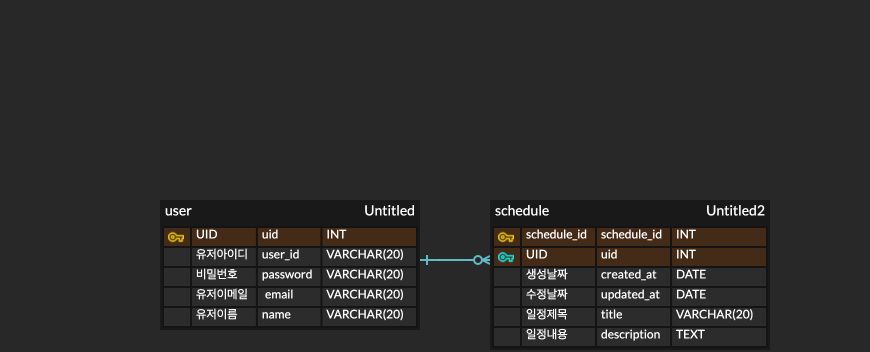

# API 명세서

## 1. 유저 API
| 기능     | 메서드    | URL              | 요청형식 | 응답형식 | 상태코드      
|--------|--------|------------------|------|------|-----------|
 유저등록 | POST    | /api/users       | json    | json | 201: 정상등록 , 400: 잘못된요청
 유저조회 | GET    | /api/users/{uid} | x    | json | 200: 정상조회 , 400: 잘못된요청
유저정보수정   | PUT   | /api/users/{uid} | json | json | 200: 정상수정 , 400: 잘못된요청

## 등록본문
| 이름       | 타입     | 필수여부 | 제한사항
|----------|--------|--------|------|
 user_id  | String |    O    | 20글자 |
password  | String |    O    | 20글자 |
name      | String |    X    | 20글자 |
email     | String |    X    | 20글자 |
### 1-1 유저 등록예시
```
POST /api/users
{
    "user_id": "asdf123", 
    "password": "123456789",
    "name": "kim",
    "email": "asdf@adf.com"
}
```
### -> 등록 응답코드예시
```
{
    "uid": 1
}
```

## 조회본문
| 이름       | 타입      | 필수여부 
|----------|---------|--------|
 uid  | Integer |    O    |
### 1-2 유저 조회예시
```
GET /api/users/{uid}
```
### -> 조회 응답코드예시
```
{
    "user_id": "asdf123",
    "password": "123456789",
    "name": "kim",
    "email": "asdf@adf.com"
}
```

## 수정본문
| 이름       | 타입     | 필수여부 | 제한사항
|----------|--------|------|------|
 name  | String | X    | 20글자 |
 email  | String | X    | 20글자 |

### 1-3 유저 정보수정예시
```
PUT /api/users/{uid}
{
    "name": "kim",
    "email": "asdf@adf.com"
}
```
### -> 수정 응답코드예시
```
{
    "uid": 1,
    "name": "kim",
    "email": "asdf@adf.com"
}
```


## 2. 일정 API
| 기능     | 메서드    | URL                | 요청형식 | 응답형식 | 상태코드      
|--------|--------|--------------------|------|------|-----------|
일정등록   | POST   | /api/schedules     | json | json | 201: 정상등록 , 400: 잘못된요청
전체일정조회 | GET    | /api/schedules     | x    | json | 200: 정상조회 , 400: 잘못된요청
특정일정조회 | GET    | /api/schedules/{schedule_id} | x    | json | 200: 정상조회 , 400: 잘못된요청
일정수정   | PUT    | /api/schedules/{schedule_id} | json | json | 200: 정상수정 , 400: 잘못된요청
일정삭제   | DELETE | /api/schedules/{schedule_id} | x    | json | 200: 정상삭제 , 400: 잘못된요청 


## 등록본문
| 이름       | 타입     | 필수여부 | 제한사항 
|----------|--------|------|------|
 title  | String | O    | 20글자 |
 description  | String | X    | X    |
 created_at      | DATE   | X    | X    |
### 2-1 일정 등록예시
```
POST /api/schedules
{
    "title": "제목",
    "description": "오늘의 일정은 이거다",
    "created_at": "2023-10-31T12:00:00Z"
}
```
### -> 등록 응답예시
```
{
    "schdule_id": 1
}
```

## 조회본문
| 이름       | 타입      | 필수여부 | 
|----------|---------|------|
 schedule_id  | Integer | O    |

### 2-2 일정 조회예시
```
GET /api/schedules      // 전체일정조회

GET /api/schedules/{schedule_id}  // 특정일정조회
```
### -> 조회 응답예시
```
{
    "schedule_id": 1,
    "uid": 1,
    "created_at": "2023-10-31T12:00:00Z"
    "updated_at": "2023-10-31T12:00:00Z"
    "title": "제목"
    "description": "일정내용"
}
```
### -> 전체조회 응답예시
```
"schedule" : [ {
    "schedule_id": 1,
    "uid": 1,
    "created_at": "2023-10-31T12:00:00Z"
    "updated_at": "2023-10-31T12:00:00Z"
    "title": "제목"
    "description": "일정내용"
}, {
    "schedule_id": 2,
    "uid": 2,
    "created_at": "2023-10-31T12:00:00Z"
    "updated_at": "2023-10-31T12:00:00Z"
    "title": "제목2"
    "description": "일정내용2"
   }
]   
```

## 수정본문
| 이름       | 타입     | 필수여부 | 제한사항 
|----------|--------|------|------|
 title  | String | O    | 20글자 |
 description  | String | X    | X    |
### 2-3 일정 수정예시
```
PUT /api/schedules/{schedule_id}
{
    "title": "바뀔 제목",
    "description": "바뀔 일정"
}
```
### -> 수정 응답예시
```
{
    "schdule_id": 1,
    "title": "수정된 제목",
    "description": "수정된 일정"
}
```


## 삭제본문
| 이름       | 타입      | 필수여부 | 
|----------|---------|------|
 schedule_id  | Integer | O    |
### 2-4 일정 삭제예시
```
DELETE /api/schedules/{schedule_id}       
```
### -> 삭제 응답예시
```
{
    "schdule_id": 1
}
```

# ERD


# SQL

## CREATE
```sql
-- User 테이블 생성
CREATE TABLE user (
    uid         INT          NOT NULL PRIMARY KEY AUTO_INCREMENT,
    user_id     VARCHAR(20)  NOT NULL,
    password    VARCHAR(20)  NOT NULL,
    email       VARCHAR(20),
    name        VARCHAR(20)
);

-- Schedule 테이블 생성 (uid를 외래키로 설정)
CREATE TABLE schedule (
    schedule_id INT          NOT NULL PRIMARY KEY AUTO_INCREMENT,
    uid         INT          NOT NULL,
    created_at  DATE,
    updated_at  DATE,
    title       VARCHAR(20)  NOT NULL,
    description TEXT,
    FOREIGN KEY (uid) REFERENCES user(uid)
);
```

## INSERT
```sql
-- User 테이블에 데이터 삽입
INSERT INTO user (uid, user_id, password, email, name)
VALUES (1, 'QWER', 'amSKskdoq3!', 'asdf@asdf.com', 'QWEA');

-- Schedule 테이블에 데이터 삽입
INSERT INTO schedule (schedule_id, uid, created_at, updated_at, title, description)
VALUES (1, 1, now(), now(), '타이틀', '오늘의 일정은 이거다');
```

## SELECT
```sql
-- User 테이블 전체 조회
SELECT * FROM user;

-- Schedule 테이블 전체 조회
SELECT * FROM schedule;

-- 특정 user_id 로 유저 조회
SELECT * FROM user
WHERE user_id = 'QFDSA';

-- 특정 schedule_id 로 일정 조회
SELECT * FROM schedule
WHERE schedule_id = 1;
```

## UPDATE
```sql
-- 유저 정보 수정
UPDATE user
SET email = 'newemail@domain.com', name = '홍길동'
WHERE user_id = 'QAZ';

-- 일정 수정
UPDATE schedule
SET title = '새로운 미팅', description = '업데이트된 일정'
WHERE schedule_id = 1;
```

## DELETE
```sql
-- 유저 정보 삭제
DELETE FROM user
WHERE user_id = 'QWERTY';

-- 일정 삭제
DELETE FROM schedule
WHERE schedule_id = 1;
```

